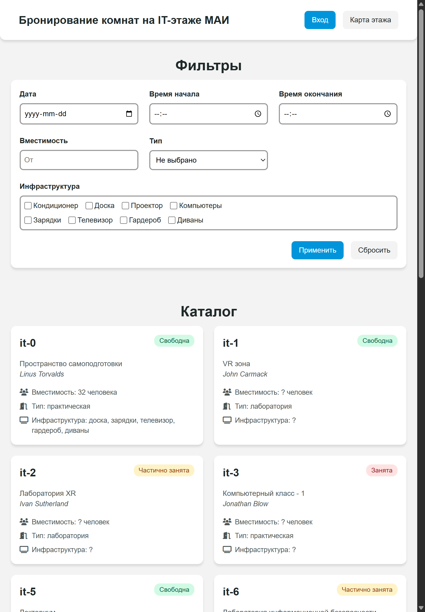

# Бронирование комнат на IT-этаже МАИ
На данный момент у проекта свёрстана клиентская часть и написана документация в Wiki.

## Интерфейс
- Все интерактивные элементы (кнопки, карточки комнат и гиперссылки) имеют специальные стили при взаимодействии с ними (наведение и нажатие). 
- Интерфейс создан с desktop first подходом, переходные размеры ширины экрана в адаптации — `1024px`, `768px` и `480px`.
- Интерфейсы модальных окон на iPad Air и iPhone 12 Pro отличаются от desktop формата только размером шрифта, поэтому их скрины не приведены ниже.

> [!NOTE]
> - [Главная страница (webpage, desktop)](#главная-страница-webpage-desktop)
> - [Главная страница (webpage, iPad Air)](#главная-страница-viewport-ipad-air)
> - [Главная страница (webpage, iPhone 12 Pro)](#главная-страница-viewport-iphone-12-pro)
> - [Страница комнаты (webpage, desktop)](#страница-комнаты-webpage-desktop)
> - [Страница комнаты (webpage, iPad Air)](#страница-комнаты-viewport-ipad-air)
> - [Страница комнаты (webpage, iPhone 12 Pro)](#страница-комнаты-viewport-iphone-12-pro)
> - [Модальное окно входа (webpage, desktop)](#модальное-окно-входа-webpage-desktop)
> - [Модальное окно личного кабинета, раздел информации (webpage, desktop)](#модальное-окно-личного-кабинета-раздел-информации-webpage-desktop)
> - [Модальное окно личного кабинета, раздел настроек (webpage, desktop)](#модальное-окно-личного-кабинета-раздел-настроек-webpage-desktop)
> - [Модальное окно панели управления (webpage, desktop)](#модальное-окно-панели-управления-webpage-desktop)
> - [Модальное окно карты этажа (webpage, desktop)](#модальное-окно-карты-этажа-webpage-desktop)

### Главная страница (webpage, desktop)

### Главная страница (viewport, iPad Air)

### Главная страница (viewport, iPhone 12 Pro)

### Страница комнаты (webpage, desktop)

### Страница комнаты (viewport, iPad Air)

### Страница комнаты (viewport, iPhone 12 Pro)

### Модальное окно входа (webpage, desktop)

### Модальное окно личного кабинета, раздел информации (webpage, desktop)

### Модальное окно личного кабинета, раздел настроек (webpage, desktop)

### Модальное окно панели управления (webpage, desktop)

### Модальное окно карты этажа (webpage, desktop)

